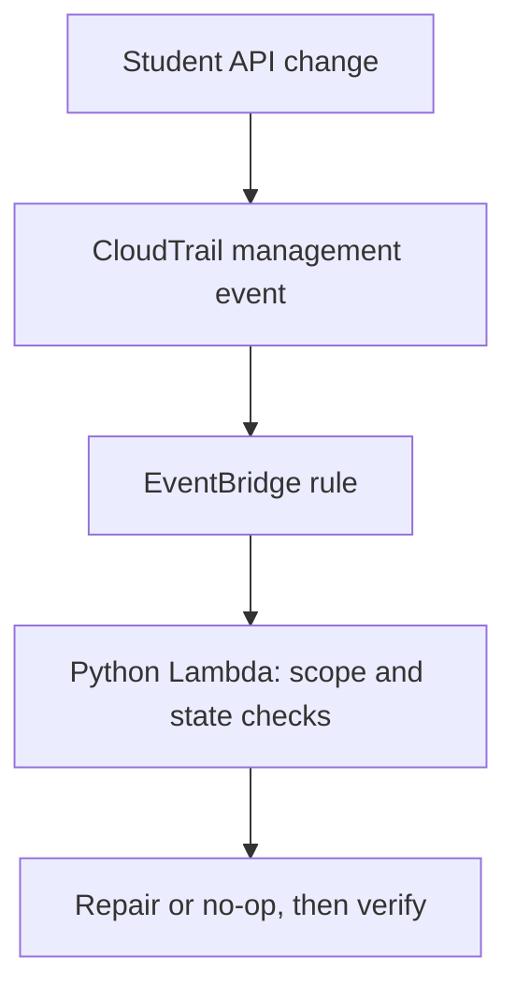

# Python as a Shield

An intermediate, hands-on workshop on protecting AWS infrastructure with Python, Boto3, Lambda and EventBridge.

Participants create a controlled misconfiguration, detect its API event, and repair it automatically. The workshop covers ten scenarios across three dedicated AWS member accounts, with ten participants per account.

## What you will learn

- Route CloudTrail API events to a Python Lambda function with EventBridge.
- Check resource ownership and current state before making a scoped repair.
- Handle duplicate events with safe no-op behavior.
- Use IAM policies, permissions boundaries, SCPs and ownership tags to limit a lab.
- Verify remediation through resource configuration and sanitized logs.

## Workshop groups

| Group | Scenarios | Student guide |
|---|---|---|
| Network | Public SSH, public RDP, all-protocol public ingress, subnet automatic public IPv4 | [Network guide](docs/network_student_guide.md) |
| Identity | AdministratorAccess attachment, wildcard inline policy, access-key creation | [Identity guide](docs/identity_student_guide.md) |
| Storage | Bucket Block Public Access changes, public SQS policy, disabled SQS encryption | [Storage guide](docs/storage_student_guide.md) |

Each student creates **one Lambda function in their assigned account**, handling that group's scenarios. Examples use `user01`; students substitute their username and two-digit participant number.

## Event flow



This is reactive remediation: a misconfiguration may exist before repair completes. Preventive controls remain useful alongside automation.

## Repository contents

| Path | Purpose |
|---|---|
| [setup/workshop_setup.md](setup/workshop_setup.md) | Instructor prerequisites, provisioning and cleanup |
| [setup/create_workshop_users.py](setup/create_workshop_users.py) | Provision participant users, bounded roles and credential CSV |
| [setup/workshop_accounts.example.json](setup/workshop_accounts.example.json) | Configuration template with user01–user10 per account |
| [setup/workshop_scp.template.json](setup/workshop_scp.template.json) | Main SCP template; render before attachment |
| [setup/workshop_tags_scp.json](setup/workshop_tags_scp.json) | Tagging guardrails |
| [docs/student_guides_index.md](docs/student_guides_index.md) | Guide selection and instructor handoff |
| `lambda/` | Python examples also embedded in the student guides |
| [tests/check_examples.py](tests/check_examples.py) | Offline mocked checks for selected remediation behavior |
| [slides/python_as_a_shield_workshop.pptx](slides/python_as_a_shield_workshop.pptx) | Editable 16-slide workshop presentation with speaker notes |

## Instructor setup

Use **dedicated sandbox member accounts** in a Workshop OU, all in **us-east-1**. Keep production workloads and sensitive data out of the lab.

Read the [complete instructor guide](setup/workshop_setup.md) before provisioning. It explains the required federated administrator roles, CLI profiles, workshop VPC and active CloudTrail management-event logging.

From the `setup` directory:

```powershell
python -m pip install --upgrade boto3
Copy-Item workshop_accounts.example.json workshop_accounts.json
```

Edit the local configuration with actual account IDs, CLI profile names, exact instructor IAM role ARNs and the workshop VPC ID. Use an IAM role ARN, not an STS session ARN. Keep the actual configuration out of Git.

Render the two SCPs:

```powershell
python create_workshop_users.py --config workshop_accounts.json --render-scp workshop_scp.json
```

Review and attach **both generated policies**, `workshop_scp.json` and `workshop_scp-tags.json`, to the **Workshop OU only**, before participant provisioning. The script does not attach policies. Do not attach the main template unchanged.

Run a read-only preflight, then provision:

```powershell
python create_workshop_users.py --config workshop_accounts.json
python create_workshop_users.py --config workshop_accounts.json --apply --csv workshop_credentials.csv
```

The apply step creates 30 participant console users, scoped permissions/boundaries, 30 Lambda execution roles, 30 EventBridge invocation roles, log groups and the inert-target boundary. Students create their own functions and exercise resources.

**Already provisioned?** Do not rerun provisioning to update or resume the deployment. The script refuses existing resources and an existing CSV; inspect partial failures and migrate or clean up deliberately.

## Student workflow

1. Receive your individual credentials and assigned group guide from the instructor.
2. Sign in through the console and select us-east-1.
3. Create your assigned resources with `Workshop=true` and `Owner=your-username` in the creation request.
4. Create `your-username-Remediator` using your existing Lambda execution role.
5. Deploy the group example, replacing its account, username and resource values.
6. Create an event-pattern rule on the default bus using your existing EventBridge invocation role.
7. Introduce one misconfiguration, verify repair, then replay a sanitized event to verify a no-op.
8. Save evidence and follow the guide's cleanup steps.

Students do not need CLI profiles, CloudShell or participant access keys. Lambda uses its execution role's temporary credentials.

## Pilot and concurrency

Before class, pilot user01 in each account. Verify the actual console creation flows, required tags/boundary, EventBridge existing-role selection, event payload fields and all ten repairs. For Storage, obtain the exact bucket Block Public Access **CloudTrail eventName** and replace its placeholder in code and the rule.

Reserved concurrency is optional. After functions exist, and each account has sufficient reservable capacity, the instructor can run:

```powershell
python create_workshop_users.py --config workshop_accounts.json --cap-concurrency --apply
```

This reserves one invocation per function. AWS requires 100 executions to remain unreserved, so ten new reservations require at least 110 total concurrency when no other reservations exist. Check actual account settings first. While a quota request is pending, use shared concurrency, short functions and one test change at a time. A concurrency reservation is not a spending cap.

## Validation and limits

Run the offline examples check from the repository root:

```powershell
python tests/check_examples.py
```

It checks selected scope rejection, duplicate/no-op behavior, SG port-range handling and preservation of unrelated rules/policy statements. It uses mocked AWS clients and does not deploy resources.

The examples have **not been integration-tested in these AWS accounts**. They implement narrow teaching baselines, not comprehensive production detection. Production use requires approved exceptions, failure monitoring, durable event handling and consideration of concurrent resource changes.

The IAM test target has a mandatory deny-all boundary. Keep it attached. S3 account-level Block Public Access remains enabled; buckets and queues remain empty. A public SQS policy can introduce temporary exposure, so remove it promptly if remediation fails.

## Keep secrets out of this repository

Never commit participant passwords, the real credential CSV, AWS access keys, session tokens, `.env` files or account-specific configuration. Share each participant's ready credential row privately. The `.gitignore` excludes common local outputs, but review every commit before pushing.

## AWS references

- [CloudTrail events in EventBridge](https://docs.aws.amazon.com/eventbridge/latest/userguide/eb-service-event-cloudtrail.html)
- [IAM permissions boundaries](https://docs.aws.amazon.com/IAM/latest/UserGuide/access_policies_boundaries.html)
- [Service control policies](https://docs.aws.amazon.com/organizations/latest/userguide/orgs_manage_policies_scps.html)
- [Lambda asynchronous retries](https://docs.aws.amazon.com/lambda/latest/dg/invocation-async-error-handling.html)
- [Lambda reserved concurrency](https://docs.aws.amazon.com/lambda/latest/dg/configuration-concurrency.html)

